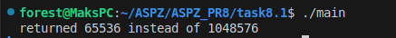
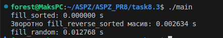
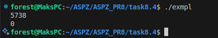
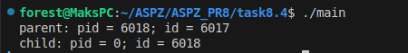
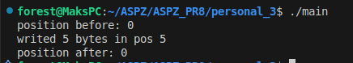

# Завдання 8.1

Чи може виклик count = write(fd, buffer, nbytes); повернути в змінній count значення, відмінне від nbytes? Якщо так, то чому? Наведіть робочий приклад програми, яка демонструє вашу відповідь.
## Рішення

#### Так, виклик 'count = write(fd, buffer, nbytes);' може повернути значення відмінне\менше за 'nbytes'.

#### Для перевірки цього завдання було написано програму, що створює 'pipe' канал (в неблокуючому режимі) між процессами, й потім процес записує в цей канал більший обсяг данних, ніж він підтримує (1мб). 

#### Наприклад в результаті ми бачимо, що 'pipe' канал зміг записати лише приблизно 64кб данних, й в результаті повертає повідомлення, що саме стільки вмістилось. 

# Завдання 8.2

Є файл, дескриптор якого — fd. Файл містить таку послідовність байтів: 4, 5, 2, 2, 3, 3, 7, 9, 1, 5. У програмі виконується наступна послідовність системних викликів: lseek(fd, 3, SEEK_SET); read(fd, &buffer, 4); де виклик lseek переміщує покажчик на третій байт файлу. Що буде містити буфер після завершення виклику read? Наведіть робочий приклад програми, яка демонструє вашу відповідь.

## Рішення

#### В цій програмі створюється файл, якщо його ще немає  та за допомогою 'lseek(fd, 3, SEEK_SET); ' зміщуємо позицію зчитування на 3 байти, оскільки відлік починається з 0, то це четвертий байт '2'. Далі програма зчитує 4 байти інформації з нашої позиції й відповідно це буде '2, 3, 3, 7'.

#### Для перевірки цього, я написав програму, що створює файл, записує туди байти '4, 5, 2, 2, 3, 3, 7, 9, 1, 5' й відповідно виконує кроки згадані вище.

# Завдання 8.3

Бібліотечна функція qsort призначена для сортування даних будь-якого типу. Для її роботи необхідно підготувати функцію порівняння, яка викликається з qsort кожного разу, коли потрібно порівняти два значення. Оскільки значення можуть мати будь-який тип, у функцію порівняння передаються два вказівники типу void* на елементи, що порівнюються.

- Напишіть програму, яка досліджує, які вхідні дані є найгіршими для алгоритму швидкого сортування. Спробуйте знайти кілька масивів даних, які змушують qsort працювати якнайповільніше. Автоматизуйте процес експериментування так, щоб підбір і аналіз вхідних даних виконувалися самостійно.
    
- Придумайте і реалізуйте набір тестів для перевірки правильності функції qsort.
## Рішення

#### Функція 'qsort' з стандартної бібліотеки виконує лгоритм сортування, що за нормальних обставин буде виконуватись за час O(n log n). Але в найгіршому випадку, наприклад, якщо масив вже відсортований, то алгоритм буде виконуватись за час O(n^2).

#### Щоб перевірити це створюються масиви, що є впорядковані за зростанням, у зворотньому та випадковому порядках. Потім для кожного з цих типів викликається 'qsort()' й перевіряється за допомогою функції порівняння. Весь цей процес вимірюється часом й виводиться у консоль.

#### Таким чином можна перевірити, який тип даних найбільше сповільнює сортування 'qsort()'.

# Завдання 8.4

Виконайте наступну програму на мові програмування С: int main() { int pid; pid = fork(); printf("%d\n", pid); } Завершіть цю програму. Припускаючи, що виклик fork() був успішним, яким може бути результат виконання цієї програми?

## Рішення

#### Фукнція 'fork' використовується для створення нового процесу, що є копією поточного. При цьому  в батьківському процесі 'PID' > 0, а в дочірнього == 0 в разі помилки отримаємо -1.

#### В наданому варіанті програми отримаємо результат, де '0' це дочірній процес.

#### У другій версії програми після виклику 'getpid()', можна наглядно побачити, що процес з 'PID' == 0, створився другим.

# Особисте завдання '3 Варіант'

Створіть програму, яка змінює вміст відкритого файлу без переміщення вказівника позиції читання/запису.

## Рішення

#### Під час стандартного доступу до файлу через файловий дескриптор, відбувається з поточної позиції вказівника, тому під час читання та запису вказівник буде автоматично зміщуватись вперед.

#### Щоб реалізувати запис до файлу буз зміщення вказівника, можна використати 'pwrite()', що записує дані із сувом 'offset', при цьому не чіпає позицію вказівника. Для читання є 'pread()'.

#### В моїй програмі я спочатку створюю файл 'file.txt', й за допомогою 'pwrite()' записую певний рядок 'HELLO' у файл. 
#### В результаті програми, можна побачити, що вказівник після запису залишився на своєму початковому місці.

